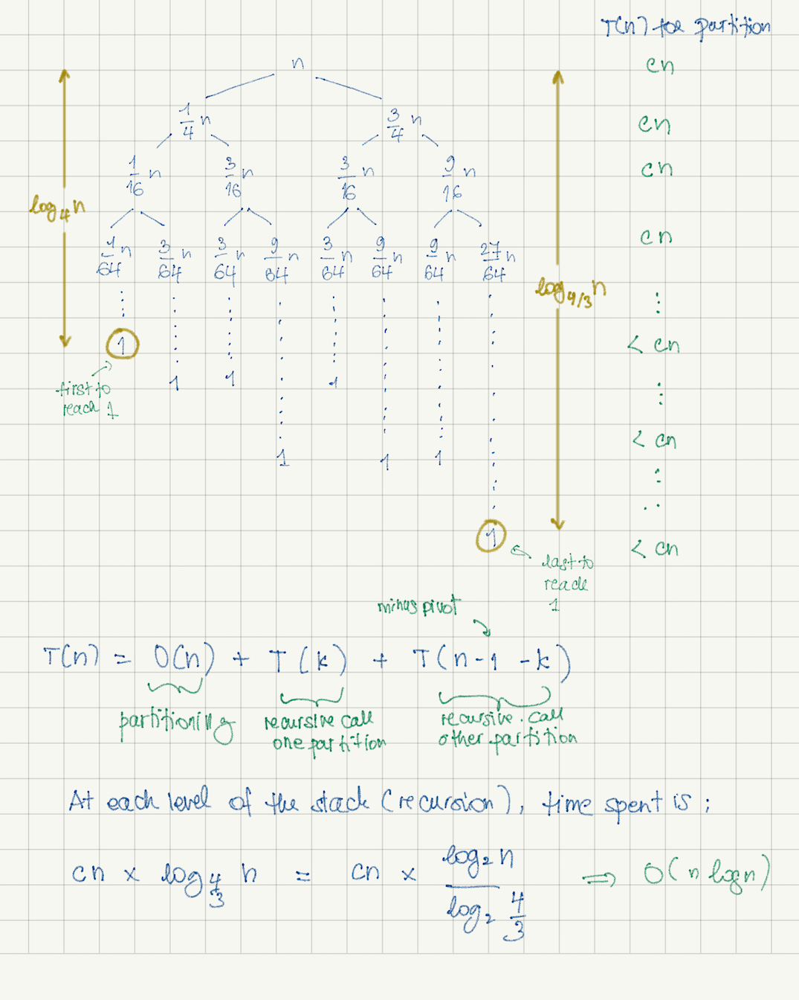

# Sorting-and-Searching
Code snippets on sorting and searching algorithms

## Quick sort
### The mechanics
Quick sort is a divide-and-conquer sorting algorithm. It is also a recursive algorithm.

It divides the input into partitions and do all the work during the partitioning.
The approach is different from merge sort (which is also a divide-and-conquer algorithm) where the work is done while 
combining the divided parts all together. 

Quick sort works in place.

##### - Divide
- Quick sort divides the input by choosing a pivot. 
- The pivot is rearranged to its correct position. The elements to its left are smaller and the elements  to its right 
are greater.
- This is called __partitioning__.

##### - Conquer
- Quick sort recursively sort the elements from the left partition and from the right partition. The sorting is done 
during the "divide" procedure.

### Time complexity

The time complexity of quick sort depends on how we choose the pivot. There are three scenarios:

##### 1. Worst case: O(n2)

Pivot is always the smallest (or the biggest) element in the array.

*N.B. in the arithmetic series, we are substracting "1" because we are not partitioning when input has only one
element.*

##### 2. Average case: O(n log(n))

Pivot is chosen so the left partition has more or less n/4 elements (minus the pivot) and the right partition has 
more or less 3n/4 elements (minus the pivot).

At each level of the stack, there are most of the time __n__ nodes. Towards the end, we have less than __n__ nodes. 
The time we spend on partitioning is at most __cn__. 

##### 3. Best case: O(n log(n))

Pivot is always chosen as the middle value. The left and right partition are equally balanced (or have a difference of 
at most 1 element).

At each level of the stack, there are __n__ nodes or less. 
The time we spend on partitioning is at most __cn__. 

### Pivot choice

##### First/Last element

One of the easiest way of choosing a pivot is either picking the first or the last element in the array.
The problem with this method is we could end up with __O(n2)__ if the array is nearly sorted.

More details here: 

[Using the first or last element as a pivot](./quicksort/README.md#picking-first-or-last-element-as-a-pivot)

##### Random element

Choosing a random element as a pivot decrease the chance of getting __O(n2)__. 

More details here: 

[Using the random element as a pivot](./quicksort/README.md#picking-a-random-element-as-a-pivot)

##### Median of three element

Another choice of pivot is to pick the median of the first, last and middle element of the array. This method works
well when the array is nearly sorted avoiding a runtime of __O(n2)__.

More details here: 

[Using the media of three elements as a pivot](./quicksort/README.md#picking-the-median-of-three-elements)

##### Median of medians

Picking the pivot by using the median of medians would ensure a runtime of __O(n Logn)__.  
The selection of the median can be done in __O(n)__.

