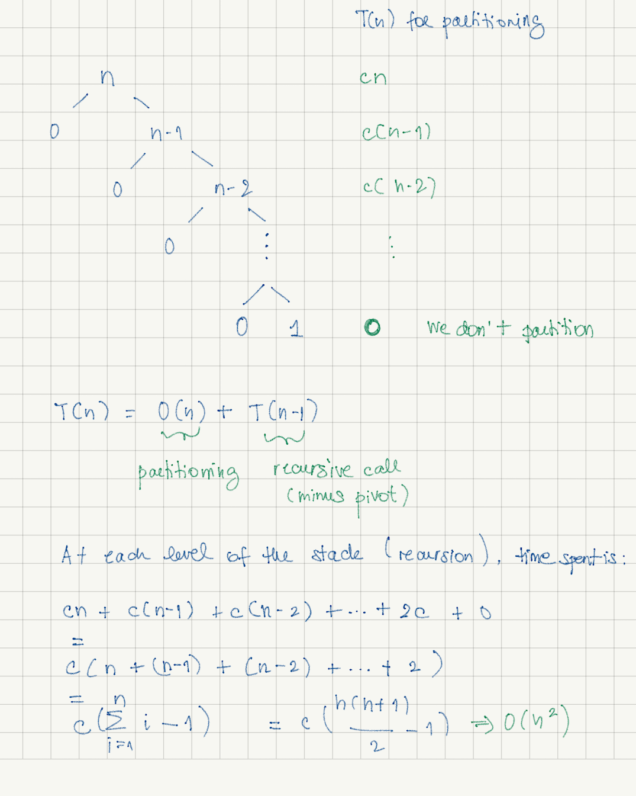
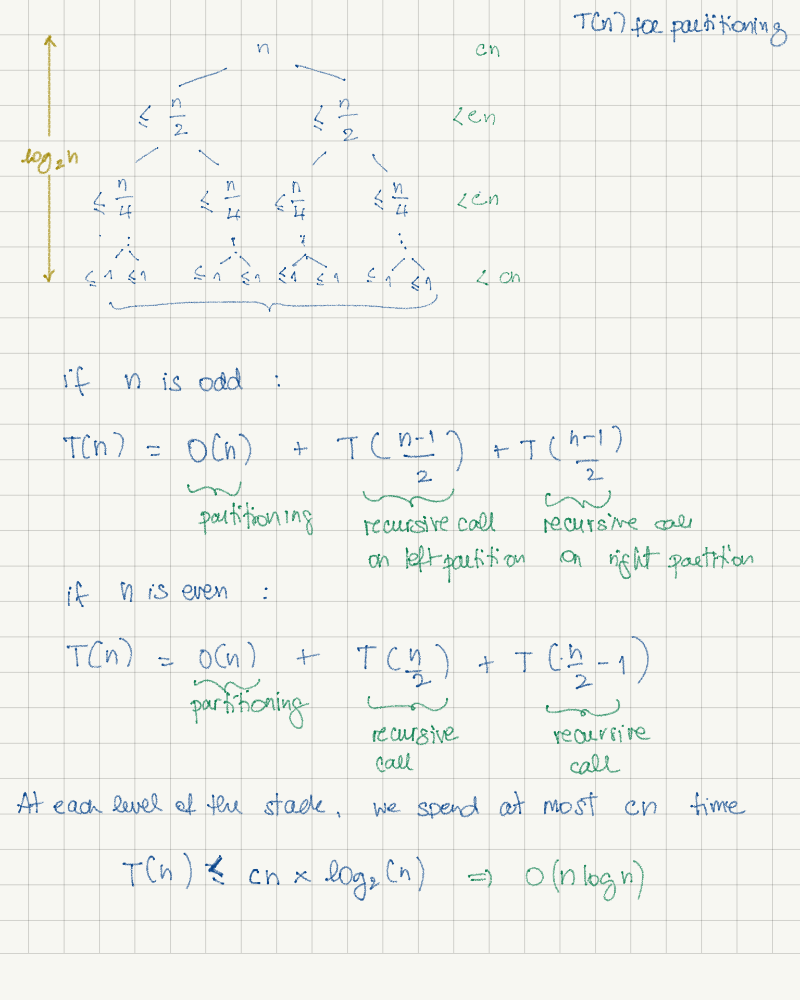

# Sorting-and-Searching
Code snippets on sorting and searching algorithms

## Quick sort
### The mechanics
Quick sort is a divide-and-conquer sorting algorithm. It is also a recursive algorithm.

It divides the input into partitions and do all the work during the partitioning.
The approach is different from merge sort (which is also a divide-and-conquer algorithm) where the work is done while 
combining the divided parts all together. 

Quick sort works in place.

##### - Divide
- Quick sort divides the input by choosing a pivot. 
- The pivot is rearranged to its correct position. The elements to its left are smaller and the elements  to its right 
are greater.
- This is called __partitioning__.

##### - Conquer
- Quick sort recursively sort the elements from the left partition and from the right partition. The sorting is done 
during the "divide" procedure.

### Time complexity

The time complexity of quick sort depends on how we choose the pivot. There are three scenarios:

##### 1. Worst case: O(n2)

Pivot is always the smallest (or the biggest) element in the array.

</a>

<small>__N.B. in the arithmetic series, we are substracting "1" because we are not partitioning when input has only one
element.__</small>

##### 2. Average case: O(n log(n))

Pivot is chosen so the left partition has more or less n/4 elements (minus the pivot) and the right partition has 
more or less 3n/4 elements (minus the pivot).

</a>

At each level of the stack, there are most of the time __n__ nodes. Towards the end, we have less than __n__ nodes. 
In average, we can say the time we spend on partitioning is at most __cn__. 

##### 3. Best case: O(n log(n))

Pivot is always chosen as the middle value. The left and right partition are equally balanced (or have a difference of 
at most 1 element).

</a>

At each level of the stack, there are __n__ nodes or less. 
In average, we can say the time we spend on partitioning is at most __cn__. 

