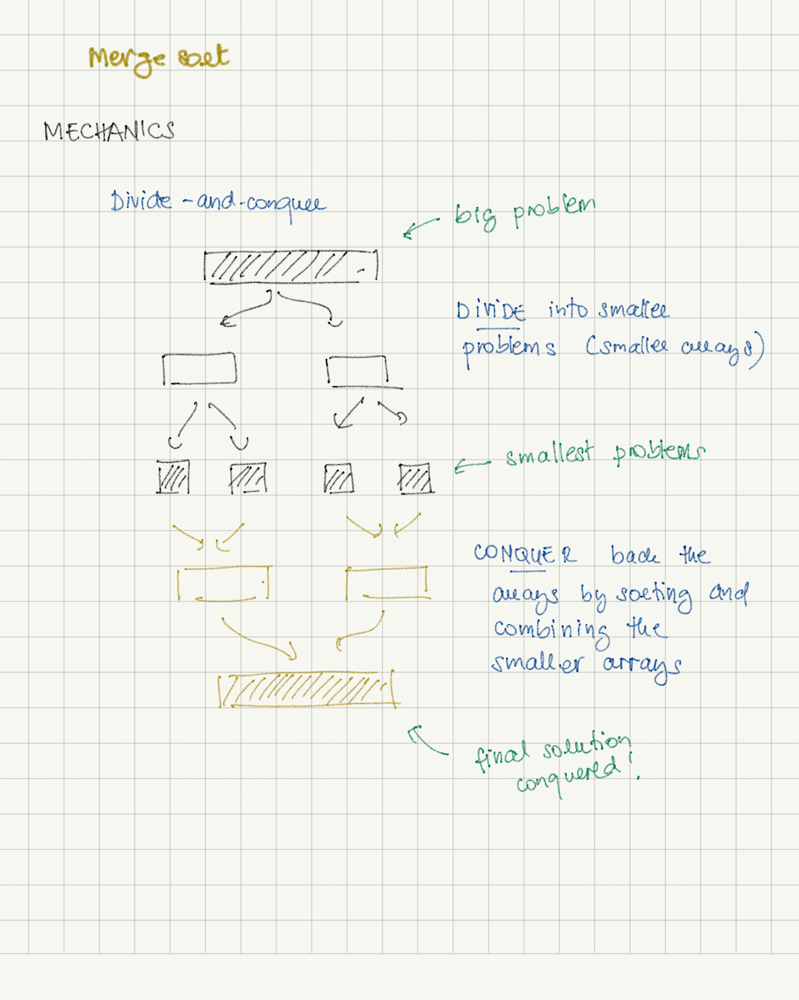

# Merge Sort 
  

## The mechanics
Merge sort is a divide-and-conquer sorting algorithm. It is also a recursive algorithm.

It divides the input into smaller sub-problems (until they are not dividable anymore) and sort the small inputs while merging back together.

The merge consists in combining the 
Unlike the quick sort where the work is done during the divide process, merge sort solves the sub-problems during the merge process.

Merge sort uses an extra auxiliary space for doing the merging.

##### - Divide
- Merge sort divides the input into smaller inputs.

##### - Conquer
- Merge sort recursively sort the elements while merging the smaller inputs and combine them all together to obtain the final sorted array.

