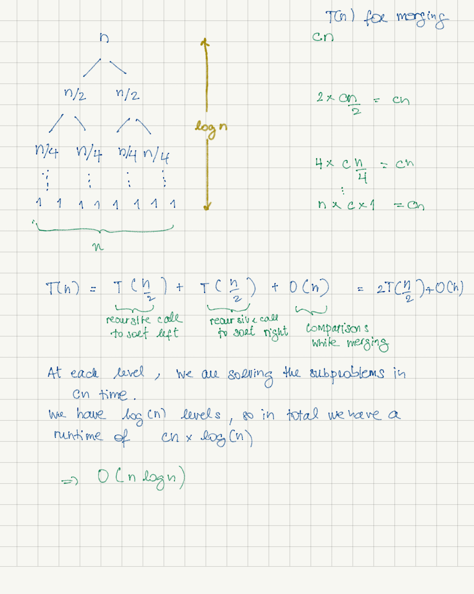
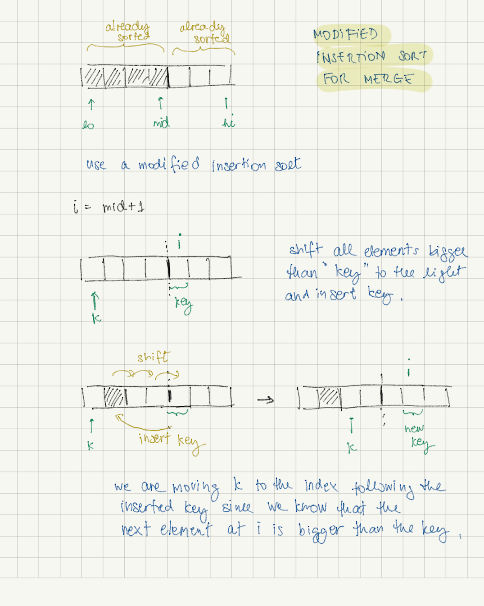

# Merge Sort 
  

## The mechanics
Merge sort is a divide-and-conquer sorting algorithm. It is also a recursive algorithm.

It divides the input into smaller sub-problems (until they are not dividable anymore) and sort the small inputs while merging back together.

The merge consists in combining the 
Unlike the quick sort where the work is done during the divide process, merge sort solves the sub-problems during the merge process.

Merge sort uses an extra auxiliary space for doing the merging.


##### - Divide
- Merge sort divides the input into smaller inputs.

##### - Conquer
- Merge sort recursively sort the elements while merging the smaller inputs and combine them all together to obtain the final sorted array.


## Time complexity

Time complexity is always __O(n log n)__. It always divides the input in half and always makes n comparison while merging.



## Code
Merge sort code: [mergesort.py](./mergesort.py)

Merge sort uses an extra auxiliary space. It could be done in-place but not in linear time. We can modify the merge function by using a similar approach as the insertion sort.



```python
def merge(arr, lo, mid, hi):

    k = lo
    # modified insertion sort from mid+1 (left side is already sorted)
    # right partition is also sorted but we need to merge left and right by inserting right elements to its left side.
    for i in range(mid+1, hi+1):
        key = arr[i]

        j = i-1

        while j >= k and arr[j] > key:
            arr[j+1] = arr[j]
            j -= 1

        arr[j+1] = key

        # move k right after the last inserted key
        # i will be pointing to the next element that is guaranteed to be greater than the inserted key
        k += 2

```

In-place merge sort : [mergesort_inplace.py](./mergesort_inplace.py)


