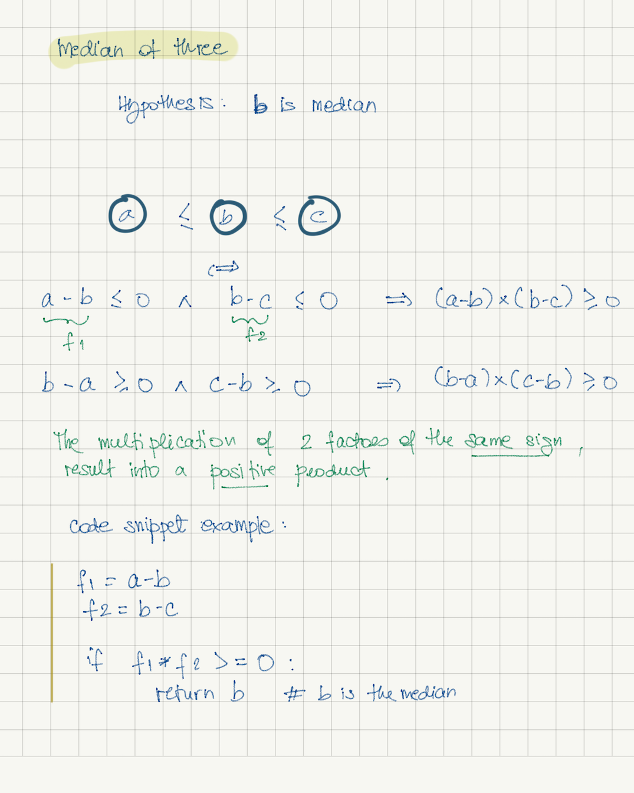
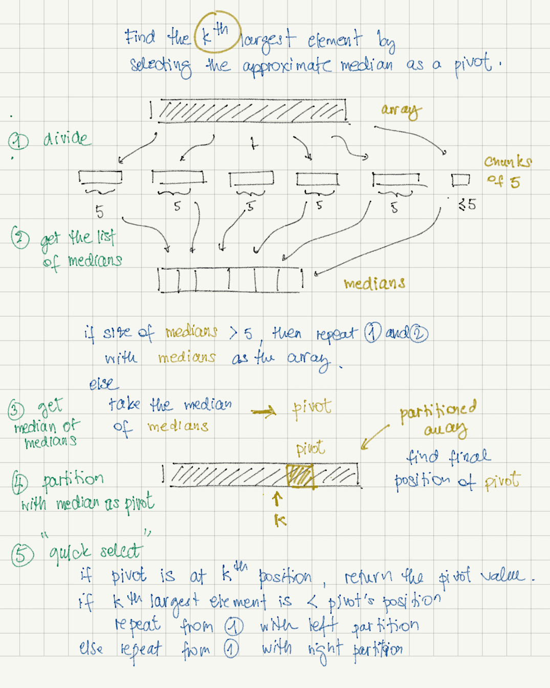

# Quick Sort 
  

#### Picking first or last element as a pivot

- Pros: 
    * easy to implement 
    * less overhead than other sorting algorithms
- Cons: 
    * take O(n<sup>2</sup>) if data is nearly sorted


##### First element: partition method based on 
[Lomuto's Partition Scheme](https://en.wikipedia.org/wiki/Quicksort#Lomuto_partition_scheme) 
or [Sedgewick's implementation](https://algs4.cs.princeton.edu/23quicksort/)

```python

def partition(arr, lo, hi):
    
    pivot = arr[lo]
    p_left = lo + 1
    p_right = hi
    
    while (True):
    
        while p_left <= hi and arr[p_left] < pivot:
            p_left += 1

        while p_right >= lo+1 and arr[p_right] > pivot:
            p_right -= 1
    
        if (p_left >= p_right):
            break
    
        arr[p_left], arr[p_right] = arr[p_right], arr[p_left]

    
    arr[p_right], arr[lo] = arr[lo], arr[p_right]
    
    return p_right
    
```

</a>


##### Last element: partition method Based on 
[Hoare’s Partition Scheme](https://en.wikipedia.org/wiki/Quicksort#Hoare_partition_scheme) 


```python

def partition(arr, lo, hi):

    pivot = arr[hi]

    index = lo

    p = lo - 1

    while index < hi:

        if arr[index] < pivot:
            p += 1
            arr[index], arr[p] = arr[p], arr[index]

        index += 1

    p += 1
    arr[hi], arr[p] = arr[p], arr[hi]

    return p
    
```
</a>


#### Picking a random element as a pivot

- Pros: 
    * helps improving the chance of getting a time complexity of __O(n log n)__ instead of __O(n<sup>2</sup>)__
    * less overhead than other sorting algorithms.
- Cons: 
    * random generator can be slow and can still give a runtime of __O(n<sup>2</sup>)__ (but most unlikely)

The quick sort implementation is as simple as implementing a random generator and reusing the partition implementation 
using the first/last element as a pivot.

Here is an example of an uniform random generator:
[My Random Generator](./my_random_generator.py)


#### Picking the median of three elements

- Pros: 
    * easy to implement
    * faster to calculate than random pivot method (but slower than the first/last element pivot method)
    * better choice of pivot when array is nearly sorted
- Cons:
    * runtime can still be __O(n<sup>2</sup>)__ if unlucky
    
Median-of-three method picks the first, last and middle elements of the array and calculate the median of all three.
After choosing the median, we switch with the first element or the last element of the array and proceed as usual for
partitioning (first/last element pivot).


There are several ways of comparing operations among variable __a__, __b__ and __c__ to determine which one is the 
median.

One brute force way is to directly represent verify the following formula:
 
 ```a <= b <= c```
 
 ```python
if (a <= b and b <= c) or (c <= b and b <= a):
    median = b

if (b <= a and a <= c) or (c <= a and a <= b):
    median = a

if (a <= c and c <= b) or (b <= c and c <= a):
    median = c

 ```
 


There are at most 6 comparisons in total. We can do better with some more mathematical deductions.

Below is the proof that we can reduce the amount of comparison to 3 (or less):




#### Picking the median of medians

- Pros:
    + guarantees an __O(n log n)__ runtime.
- Cons:
    + harder to implement
    + constant much higher than the other pivot algorithms (number of comparisons is high)

The median of medians algorithm uses a divide-and-conquer method to select an approximate median as a pivot for a 
partitioning algorithm.

The algorithm divides the array into chunks of 5 elements and pick the median of each of them.

From the list of these medians, we calculate the median of all medians and use it as a pivot with the quick select 
approach to find the kth largest element in the array.

The selection of the pivot runs in __O(n)__.
For more information on median of medians: 
[https://en.wikipedia.org/wiki/Median_of_medians](https://en.wikipedia.org/wiki/Median_of_medians).

</a>

Example of code: [median_of_medians.py](./median_of_medians.py)


