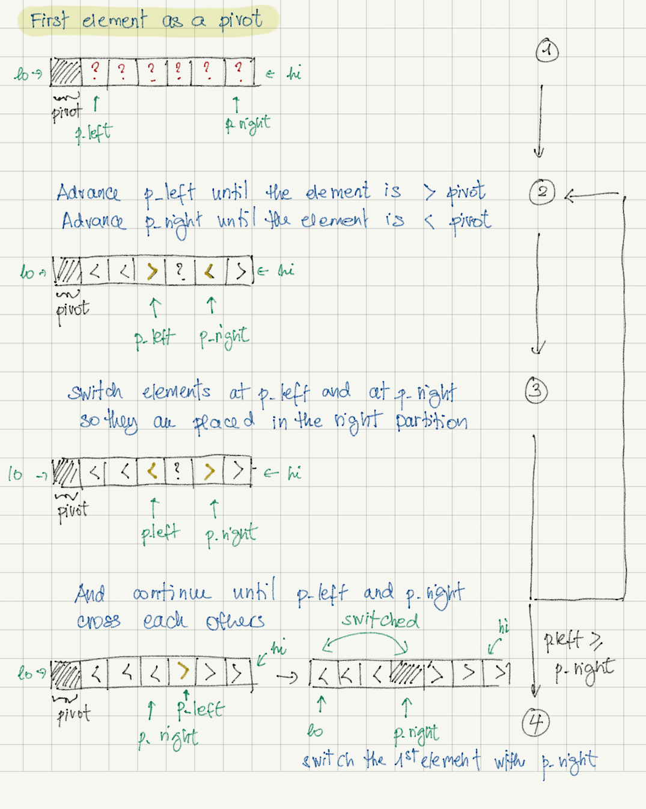
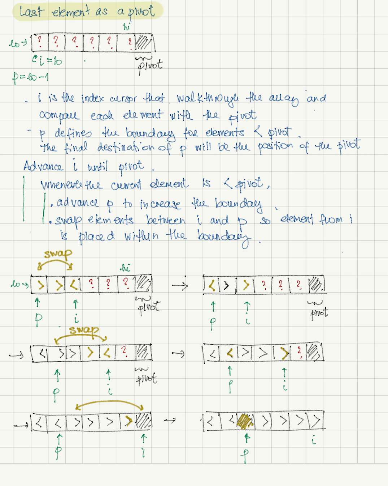

# Quick Sort 
  

#### Partitioning with first element as pivot

Based on [Lomuto's Partition Scheme](https://en.wikipedia.org/wiki/Quicksort#Lomuto_partition_scheme)

```python

def partition(arr, lo, hi):
    
    pivot = arr[lo]
    p_left = lo + 1
    p_right = hi
    

    while (True):

    
        while p_left <= hi and arr[p_left] < pivot:
            p_left += 1

    
        while p_right >= lo+1 and arr[p_right] > pivot:
            p_right -= 1

    
        if (p_left >= p_right):
            break

    
        arr[p_left], arr[p_right] = arr[p_right], arr[p_left]

    
    arr[p_right], arr[lo] = arr[lo], arr[p_right]

    
    return p_right
```

</a>


#### Partitioning with last element as pivot

Based on [Hoare’s Partition Scheme](https://en.wikipedia.org/wiki/Quicksort#Hoare_partition_scheme) or 
[Sedgewick's implementation](https://algs4.cs.princeton.edu/23quicksort/)


```python

def partition(arr, lo, hi):

    pivot = arr[hi]

    index = lo

    p = lo - 1

    while index < hi:

        if arr[index] < pivot:
            p += 1
            arr[index], arr[p] = arr[p], arr[index]

        index += 1

    p += 1
    arr[hi], arr[p] = arr[p], arr[hi]

    return p
```
</a>

