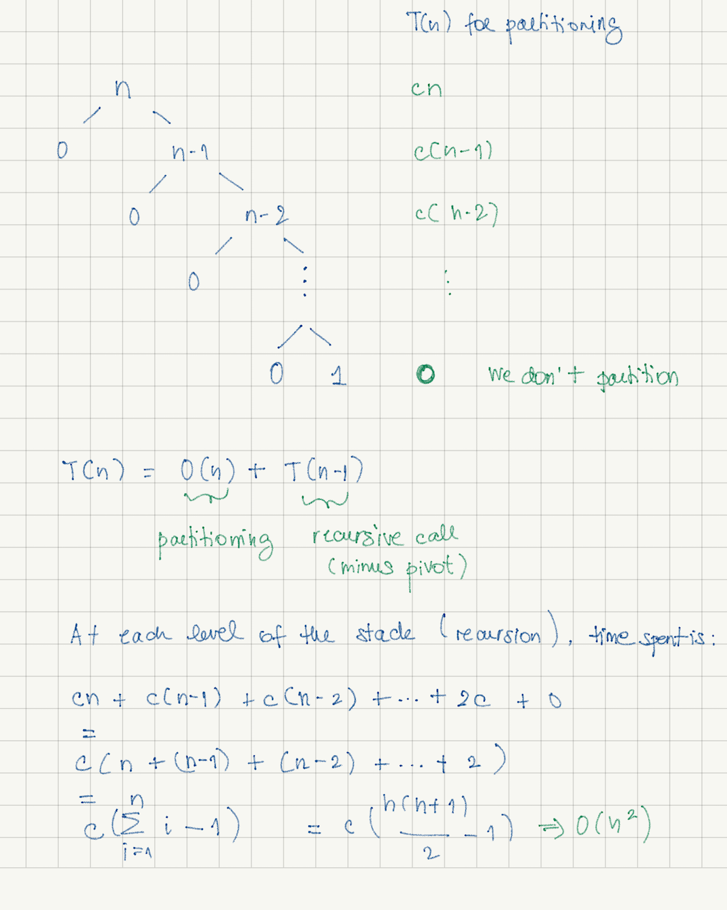
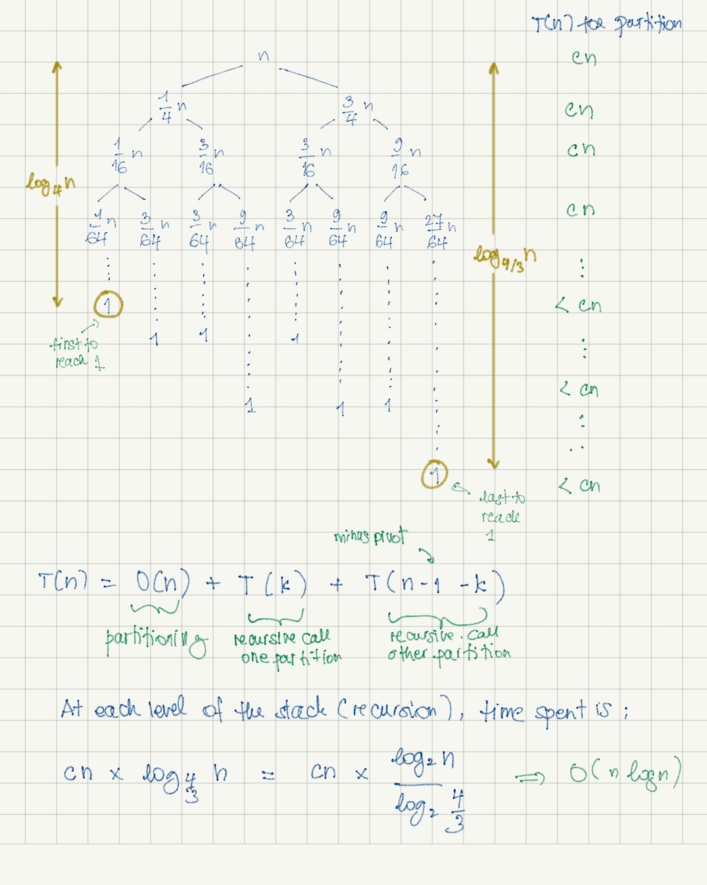

# Quick Sort 
  

## The mechanics
Quick sort is a divide-and-conquer sorting algorithm. It is also a recursive algorithm.

It divides the input into partitions and do all the work during the partitioning.
The approach is different from merge sort (which is also a divide-and-conquer algorithm) where the work is done while 
combining the divided parts all together. 

Quick sort works in place.

##### - Divide
- Quick sort divides the input by choosing a pivot. 
- The pivot is rearranged to its correct position. The elements to its left are smaller and the elements  to its right 
are greater.
- This is called __partitioning__.

##### - Conquer
- Quick sort recursively sort the elements from the left partition and from the right partition. The sorting is done 
during the "divide" procedure.

## Time complexity

The time complexity of quick sort depends on how we choose the pivot. There are three scenarios:

##### 1. Worst case: O(n<sup>2</sup>)

Pivot is always the smallest (or the biggest) element in the array.



*N.B. in the arithmetic series, we are substracting "1" because we are not partitioning when input has only one
element.*

##### 2. Average case: O(n log(n))

Pivot is chosen so the left partition has more or less n/4 elements (minus the pivot) and the right partition has 
more or less 3n/4 elements (minus the pivot).



At each level of the stack, there are most of the time __n__ nodes. Towards the end, we have less than __n__ nodes. 
The time we spend on partitioning is at most __cn__. 


##### 3. Best case: O(n log(n))

Pivot is always chosen as the middle value. The left and right partition are equally balanced (or have a difference of 
at most 1 element).


At each level of the stack, there are __n__ nodes or less. 
The time we spend on partitioning is at most __cn__. 


## Pivot choice


#### Picking first or last element as a pivot

One of the easiest way of choosing a pivot is either picking the first or the last element in the array.
The problem with this method is we could end up with __O(n<sup>2</sup>)__ if the array is nearly sorted.

- Pros: 
    * easy to implement 
    * less overhead than other sorting algorithms
- Cons: 
    * take O(n<sup>2</sup>) if data is nearly sorted


##### First element: partition method based on 
[Lomuto's Partition Scheme](https://en.wikipedia.org/wiki/Quicksort#Lomuto_partition_scheme) 
or [Sedgewick's implementation](https://algs4.cs.princeton.edu/23quicksort/)

```python

def partition(arr, lo, hi):
    
    pivot = arr[lo]
    p_left = lo + 1
    p_right = hi
    
    while (True):
    
        while p_left <= hi and arr[p_left] < pivot:
            p_left += 1

        while p_right >= lo+1 and arr[p_right] > pivot:
            p_right -= 1
    
        if (p_left >= p_right):
            break
    
        arr[p_left], arr[p_right] = arr[p_right], arr[p_left]

    
    arr[p_right], arr[lo] = arr[lo], arr[p_right]
    
    return p_right
    
```

</a>


##### Last element: partition method Based on 
[Hoare’s Partition Scheme](https://en.wikipedia.org/wiki/Quicksort#Hoare_partition_scheme) 


```python

def partition(arr, lo, hi):

    pivot = arr[hi]

    index = lo

    p = lo - 1

    while index < hi:

        if arr[index] < pivot:
            p += 1
            arr[index], arr[p] = arr[p], arr[index]

        index += 1

    p += 1
    arr[hi], arr[p] = arr[p], arr[hi]

    return p
    
```
</a>


#### Picking a random element as a pivot

Choosing a random element as a pivot decrease the chance of getting __O(n<sup>2</sup>)__. 


- Pros: 
    * helps improving the chance of getting a time complexity of __O(n log n)__ instead of __O(n<sup>2</sup>)__
    * less overhead than other sorting algorithms.
- Cons: 
    * random generator can be slow and can still give a runtime of __O(n<sup>2</sup>)__ (but most unlikely)

The quick sort implementation is as simple as implementing a random generator and reusing the partition implementation 
using the first/last element as a pivot.

Here is an example of an uniform random generator:
[My Random Generator](./my_random_generator.py)


#### Picking the median of three elements

Another choice of pivot is to pick the median of the first, last and middle element of the array. This method works
well when the array is nearly sorted avoiding a runtime of __O(n<sup>2</sup>)__.

- Pros: 
    * easy to implement
    * faster to calculate than random pivot method (but slower than the first/last element pivot method)
    * better choice of pivot when array is nearly sorted
- Cons:
    * runtime can still be __O(n<sup>2</sup>)__ if unlucky
    
Median-of-three method picks the first, last and middle elements of the array and calculate the median of all three.
After choosing the median, we switch with the first element or the last element of the array and proceed as usual for
partitioning (first/last element pivot).


There are several ways of comparing operations among variable __a__, __b__ and __c__ to determine which one is the 
median.

One brute force way is to directly represent verify the following formula:
 
 ```a <= b <= c```
 
 ```python
if (a <= b and b <= c) or (c <= b and b <= a):
    median = b

if (b <= a and a <= c) or (c <= a and a <= b):
    median = a

if (a <= c and c <= b) or (b <= c and c <= a):
    median = c

 ```
 


There are at most 6 comparisons in total. We can do better with some more mathematical deductions.

Below is the proof that we can reduce the amount of comparison to 3 (or less):


#### Picking the median of medians

Picking the pivot by using the median of medians would ensure a runtime of __O(n Logn)__.  

- Pros:
    + guarantees an __O(n log n)__ runtime.
- Cons:
    + harder to implement
    + constant much higher than the other pivot algorithms (number of comparisons is high)

The median of medians algorithm uses a divide-and-conquer method to select an approximate median as a pivot for a 
partitioning algorithm.

The algorithm divides the array into chunks of 5 elements and pick the median of each of them.

From the list of these medians, we calculate the median of all medians and use it as a pivot with the quick select 
approach to find the kth largest element in the array.

The selection of the pivot runs in __O(n)__.
For more information on median of medians: 
[https://en.wikipedia.org/wiki/Median_of_medians](https://en.wikipedia.org/wiki/Median_of_medians).

</a>

Example of code: [median_of_medians.py](./median_of_medians.py)


## Features

#### Parallelizable

The mechanics of quick sort is to divide the list into two partitions and recursively quick sort the left and right partitions. 

Due to the nature of this mechanics, it is possible to quick sort the left partition on a new child process and to quick sort the right partition on another process concurrently.

#### Extendable to k-way distribution sort

Quick sort can be distributed into two sub-tasks (quick sort left and right partitions) but can be also be distributed into three sub-tasks (or even more). 

An easy way to think on how to partition is to categorize the partitions. 

For example, in a 3 ways distribution, we can categorize 
* the first partition as a segment containing numbers from n1 to n1<sup>'</sup>
* the second partition as a segment containing numbers from n2 to n2<sup>'</sup>
* the third partition as a segment container numbers from n3 to n3<sup>'</sup>.

The 3 ways distribution is useful for sorting an array with many duplicates.


#### Memory access not sequential

While partitioning, quick sort swaps elements that are not sequentially allocated inside the memory.


